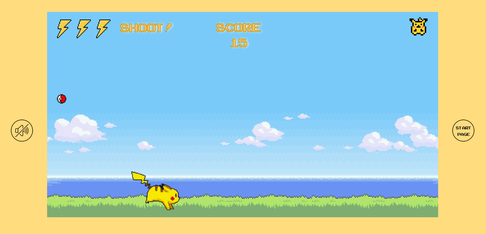

# Description
Pikachu is going for a run by the beach and has to avoid any pokemon he might encounter. 
He can do it by jumping over or shooting them but... watch out!  
He has to first collect enough pokeballs in order to have the energy to do that!

# How to play
Press "Arrow Left" to move left, "Arrow Right" to move right and "Arrow Up" to jump. 
With the "Space Bar" you can make Pikachu shoot a lightning that will make his flying oponents disappear.

# Demo
You can play the game <a href="https://amcasep.github.io/Pikachu-Game/">here</a>
